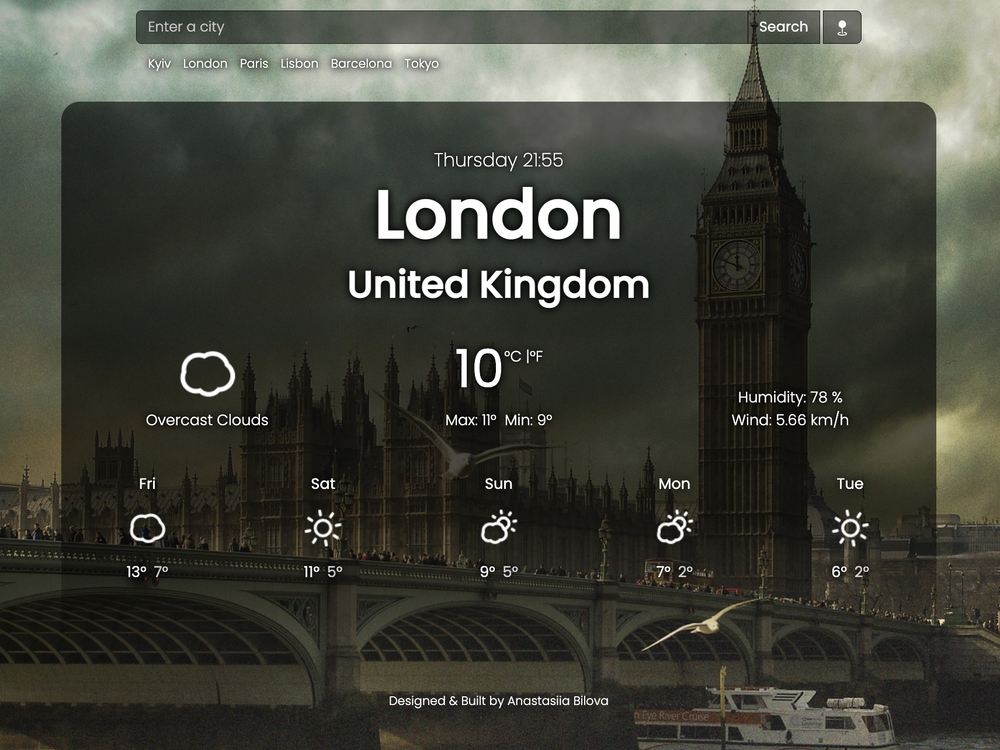
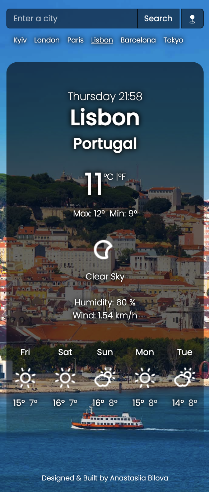

# 🌦️ React Weather Forecast Application

The Weather Forecast app helps you get the weather forecast for your current location for the next 5 days. You have the option to get the weather forecast in degrees Celsius or Fahrenheit. The application has an adaptive design, that is, the interface adapts to the layout of the device, making it easier to use, navigate and search for information. In addition, the background image changes dynamically for each city entered.

## Available Scripts

In the project directory, you can run:

### `npm start`

Runs the app in the development mode.\
Open [http://localhost:3000](http://localhost:3000) to view it in your browser.

The page will reload when you make changes.\
You may also see any lint errors in the console.

### `npm run build`

Builds the app for production to the `build` folder.\
It correctly bundles React in production mode and optimizes the build for the best performance.

The build is minified and the filenames include the hashes.\
Your app is ready to be deployed!

See the section about [deployment](https://facebook.github.io/create-react-app/docs/deployment) for more information.
